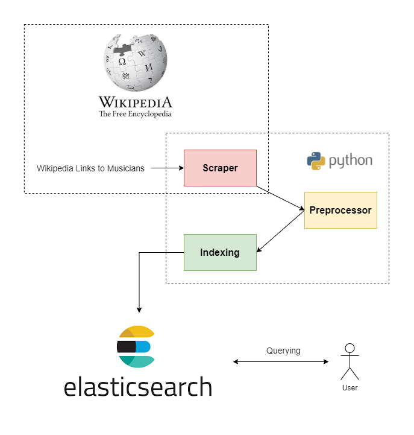
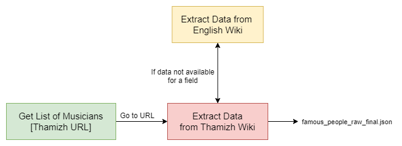

# Thamizh Search on Famous Musicians



This project was implemented as part of the CS4642 - Data Mining & 
Information Retrieval module. The task was to create an index for 
documents about famous people. I have geared my project towards
famous musicians. The index should type various types of queries 
and also there should at least be two text fields. ElasticSearch 
was used to for indexing. Whereas beautifulsoup was used for 
scraping. 

The important files and directories of the repository is shown below.
```
project
│   README.md
│   scraping.ipynb - Scraping functions and saving json
|   preprocessing.ipynb - Preprocessing functions 
|   indexing.ipynb  - Indexing to elastic search 
│
└───data
│   │   famous_people_raw_final.json - Raw scraped data outputed from scraping.ipynb
│   │   famous_people_cleaned_final.json - Cleaned data outputed from preprocessing.ipynb
│   
└───images - Architecture and Pipeline diagrams
```

The project was implemented in three phases; 
1. Data Scraping 
2. Data Preprocessing
3. Indexing

Finally after the completion of the above three steps finally 
multiple queries were executed on the index and verified. The 
following sections describe each of the above three phases in detail.

---

- **Data Scraping**



Data was scraped using [BeautifulSoup](https://www.crummy.com/software/BeautifulSoup/) 
which is a python library used for web scraping. Two lists were used
during scraping.
1. [List of Tamil Singers from Wikipedia](https://ta.wikipedia.org/wiki/%E0%AE%A4%E0%AE%AE%E0%AE%BF%E0%AE%B4%E0%AF%8D%E0%AE%A4%E0%AF%8D_%E0%AE%A4%E0%AE%BF%E0%AE%B0%E0%AF%88%E0%AE%AA%E0%AF%8D%E0%AE%AA%E0%AE%9F%E0%AE%AA%E0%AF%8D_%E0%AE%AA%E0%AE%BE%E0%AE%9F%E0%AE%95%E0%AE%B0%E0%AF%8D%E0%AE%95%E0%AE%B3%E0%AE%BF%E0%AE%A9%E0%AF%8D_%E0%AE%AA%E0%AE%9F%E0%AF%8D%E0%AE%9F%E0%AE%BF%E0%AE%AF%E0%AE%B2%E0%AF%8D) 
2. [List of Tamil Composers from Wikipedia](https://ta.wikipedia.org/wiki/%E0%AE%87%E0%AE%9A%E0%AF%88%E0%AE%AF%E0%AE%AE%E0%AF%88%E0%AE%AA%E0%AF%8D%E0%AE%AA%E0%AE%BE%E0%AE%B3%E0%AE%B0%E0%AF%8D%E0%AE%95%E0%AE%B3%E0%AE%BF%E0%AE%A9%E0%AF%8D_%E0%AE%AA%E0%AE%9F%E0%AF%8D%E0%AE%9F%E0%AE%BF%E0%AE%AF%E0%AE%B2%E0%AF%8D)

Both these lists were used to collect the names of the musicians and 
the urls of their Thamizh wiki page. The dataset created had the
fields,
- பெயர் - Name of the musician (String)
- அறிமுகம் - Introduction (String)
- உள்ளடக்கம் - Content (String)
- முதல் படம் - First film that the musician featured in (String)
- அறிமுக ஆண்டு - Year in which musician was introduced (String)
- பிறந்த திகதி - Date of Birth (DateTime)
- பிறப்பிடம் - Place of Birth (String)
- செயற்பாட்டுக் காலம் - Active years (String)
- தொழில் - What roles the musican took on (Array of Strings)
- இசை வடிவங்கள் - What was the musician known for (stage music, playback singing etc.) (Array of Strings)
- இசைக்கருவிகள் - Instruments that the musician played (Array of Strings)

After collecting the urls each individual page was scraped and then 
missing information was filled by using the English version of the 
same page (i.e. say place of birth was missing in the Thamizh page 
then it was searched for in the English page of the relevant musician).

- **Data Preprocessing**


Two fields (Introduction and Content) required alot of the preprocessing.
The other fields had less then 3 tokens therefore required little/ none.
1. For the two long text fields after clear inspection it was found that 
the text within the paranthesis was not very informative. Therefore it
was removed first. 
2. Then punctuations except for full stops were removed. 
3. Following that english characters from the text was removed. 
4. Numbers and extra whitespaces were removed finally.

Two other fields (date of birth and place of birth) were translated to
Thamizh to use in querying. Translation was carried out using 
[google_trans_new](https://github.com/lushan88a/google_trans_new).

- **Indexing**


Finally the cleaned data was indexed in ElasticSearch.
For this the [python client for ElasticSearch](https://github.com/elastic/elasticsearch-py)
was used. For index creation the following query was issued.

```json
{
  "settings" : {

    "analysis" : {
      "analyzer" : {
        "text_analyzer" : {
          "tokenizer" : "standard",
          "filter" : [
            "tamil_stopper",
            "indic_normalization",
            "tamil_stemmer"
          ]
        }
      },
      "filter" : {
        "tamil_stemmer" : {
          "type" : "hunspell",
          "locale" : "ta_IN"
        },
        "tamil_stopper" : {
          "type" : "stop",
          "stopwords_path" : "tamilstop/stopwords.txt"
        }
      }
    }
  },

  "mappings" : {
    "properties" : {
      "அறிமுகம்": {
        "type" : "text",
        "analyzer" : "text_analyzer"
      },
      "உள்ளடக்கம்": {
        "type" : "text",
        "analyzer" : "text_analyzer"
      },
      "பிறந்த திகதி": {
        "type" : "date",
        "format" : "dd/mm/yyyy"
      },
      "பிறந்த மாதம்":{
        "type": "text",
        "fielddata": true
      }
    }
  }

}
```

A custom analyzer was used for the text fields (intro and content).
This analyzer contained the following components,
1. Tokenizer - Standard Tokenizer available on ElasticSearch proved sufficient.
2. StopWords Remover - StopWords list was obtained from [AshokR](https://github.com/AshokR/TamilNLP/tree/master/tamilnlp/Resources).
3. Indic Normalizer - The indic normalizer was applied before stemming to normalize the Unicode representation of text.
4. Stemmer - Finally the tokens were stemmed using hunspell stemmer. Stemming lists were obtained from [AshokR](https://github.com/AshokR/TamilNLP/tree/master/tamilnlp/Resources).

For the date field, type was mentioned as date and the format as dd/mm/yyyy.
If not set will not be able to do range queries on this field. Also the month
field is set as fielddata in order to do aggregate queries on it.

---

### Queries

The following queries could be executed on the created index.
1. *Fundamental Search* - User can search with a query string across all fields. In the example below we search for உதித் in all fields.
```json
{
  "query": {
    "query_string": {
      "query": "உதித்",
      "fuzziness" : "AUTO"
    }
  }
}
```
2. *Wildcard query* - Similar to the above query but the user can search with wildcards denoted by *. Similarly this can be done for field based query as well. In the below example we use இளைய* which would return everything starting with it.
```json
{
  "query": {
    "query_string": {
      "query": "இளைய*"
    }
  }
}
```
3. *Simple match query* - User can specify the query string but can search within a particular field.
```json
{
  "query" : {
    "match" : {
      "பெயர்" : {
        "query" : "ஏ. எம். ராஜா",
        "fuzziness" : "AUTO"
      }
    }
  }
}

{
  "query":{
    "match":{
      "தொழில்": "நடிகர்"
    }
  }
}
```
4. *Multi match query* - Users search in multiple fields and match with a OR conidition.
```json
{
  "query" : {
    "multi_match" : {
      "query" : "பாலசுப்பிரமணியம்",
      "fields": ["அறிமுகம்","உள்ளடக்கம்"]
    }
  }
}
```
5. *Range query* - Here user can specify a range to accumulate data from. Below we get musicians born between 1970-1980.
```json
{
  "query": {
    "range": {
      "பிறந்த திகதி": {
        "gte": "01/01/1970",
        "lte": "01/01/1980"
      }
    }
  }
}
```
6. *Bool query* - Can define must and must not queries. In the following example we check if person is born in Chennai in July and must not be born after 1980.
```json
{
  "query": {
    "bool" : {
      "must" : [
        {
          "match": { "பிறப்பிடம் தமிழில்": "சென்னை" }
        },
        {
          "match": { "பிறந்த திகதி தமிழில்": "ஆடி" }
        }
      ],
      "must_not" : [
        {
          "range" : {
            "பிறந்த திகதி" : {
              "gte" : "01/01/1980"
            }
          }
        }
      ]
    }
  }
}
```
7. *Bool prefix query* - Check if the documents contain the exact prefix and returns results.
```json
{
    "query": {
        "match_bool_prefix" : {
            "உள்ளடக்கம்" : "பிரபலமான திரை"
        }
    }
}
```
8. *Phrase match query* - Match phrases instead of single words. In the below example we do a biword match.
```json
{
    "query": {
        "match_phrase": {
            "உள்ளடக்கம்": "பயிற்சி பெற்றிருந்தார்"
        }
    }
}
```
9. *More like this query* - MLT queries are helpful in text mining and hence
   extending the support to a huge input space and can be used in text mining.
```json
{
    "query":{
       "more_like_this":{
          "fields":[
             "அறிமுகம்"
          ],
          "like":"கமல்ஹாசன் ஒரு புகழ்பெற்ற இந்தியத் திரைப்பட நடிகரும் மற்றும் அரசியல்வாதியும் ஆவார். இவர் சில திரைப்படங்களை இயக்கியும் உள்ளார். இவரின் மாறுபட்ட வேடங்களைக் கொண்ட நடிப்பிற்காக பரவலாக அறியப்படுகிறார். கமல்ஹாசன் சிறந்த குழந்தை நட்சத்திரம் மற்றும் சிறந்த நடிகர் என்ற முறையில் 4 தேசிய விருதுகளும், சிறந்த படம் என்ற முறையில் தயாரிப்பாளராக 1 தேசிய விருதும், 10 தமிழக அரசு திரைப்பட விருதுகள்கள், 4 ஆந்திர அரசின் நந்தி விருதுகள், 19 பிலிம்பேர் விருதுகள் உள்ளடங்கலாக பல இந்திய விருதுகளை வென்றுள்ளார், இவர் சிறந்த பிறமொழிப்படத்திற்கான, அகாதமி விருதிற்கு இந்தியாவிலிருந்து பரிந்துரைக்கப்பட்ட திரைப்படங்களில் அதிகமானவற்றிலும் நடித்திருந்தார்.நடிகராக மட்டுமல்லாது திரைக்கதையாசிரியர், இயக்குநர், பாடலாசிரியர், பின்னணிப் பாடகர், நடன அமைப்பாளர் எனப் பன்முகத்தன்மை கொண்டவராக விளங்குகின்றார்.இந்திய திரைத்துறைக்கு ஆற்றிய பணிக்காக பத்ம பூசண், பத்மசிறீ விருதும் அவருக்கு வழங்கப்பட்டுள்ளது. அத்துடன் சத்தியபாமா பல்கலைக்கழகம் கமல்ஹாசனிற்கு கௌரவ முனைவர் பட்டம் வழங்கி கௌரவித்தது. 2019 இல் 60 ஆண்டுகளை திரைத்துறையில் நிறைவுசெய்த இந்திய நடிகர்கள் மிகச்சிலரில் ஒருவரானார்.",
          "min_term_freq":1,
          "max_query_terms":20
       }
    }
  }
```
10. *Term aggregation query* - Used to create buckets and aggregate returned results. In the below query we get musicians born between 1960-1990 and then aggregate them using the months in which they were born.
```json
{
    "size" : 0,
    "query": {
        "range": {
            "பிறந்த திகதி": {
                "gte": "01/01/1960",
                "lte": "01/01/1990"
            }
        }
    },
    "aggs": {
        "months": {
            "terms": {
                "field": "பிறந்த மாதம்"
            }
        }
    }
}
```
